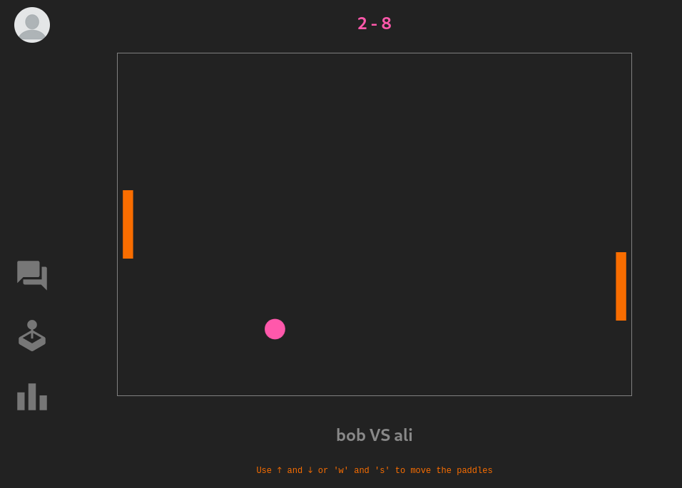

# ft_transcendance (42 project)

Group project. Website to play a pong game, and chat with your friends.

- backend in nestJS
- frontend in Svelte
- socketIO is used to handle websockets

## Requirements

- docker compose
- .env with secret from 42 API

